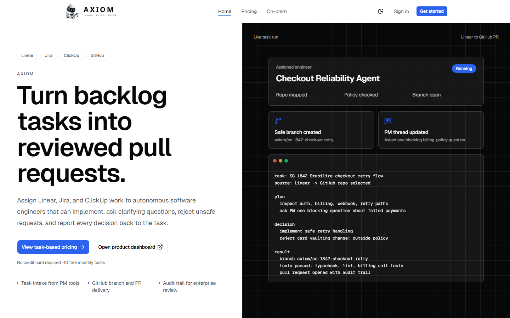
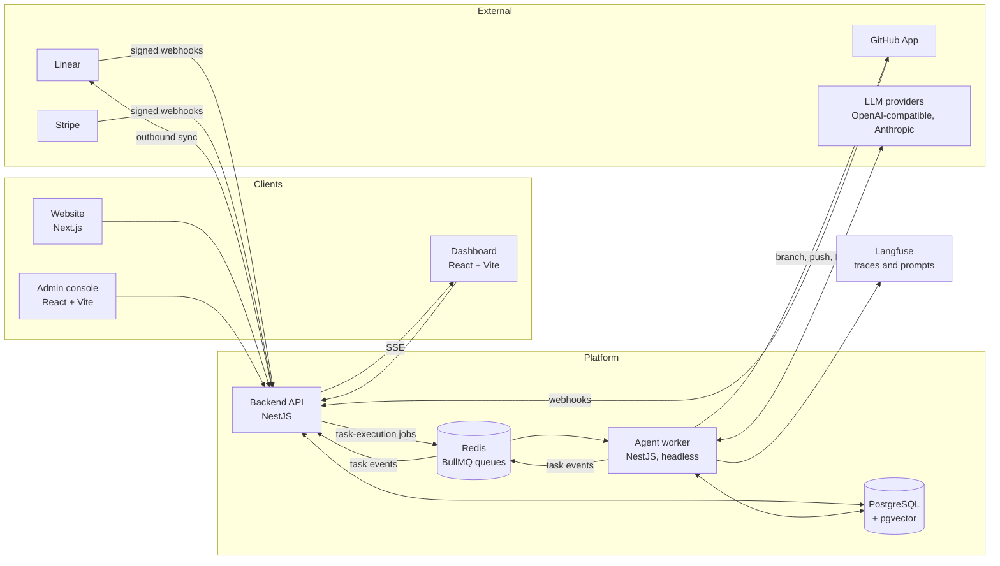
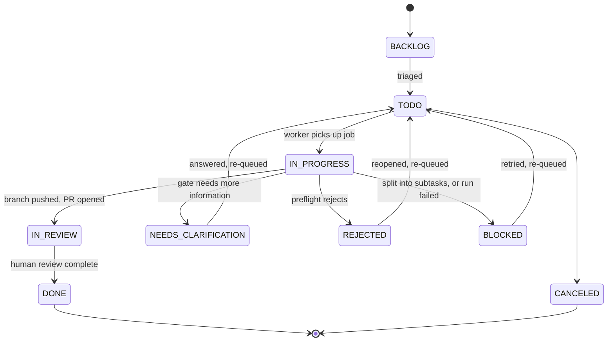
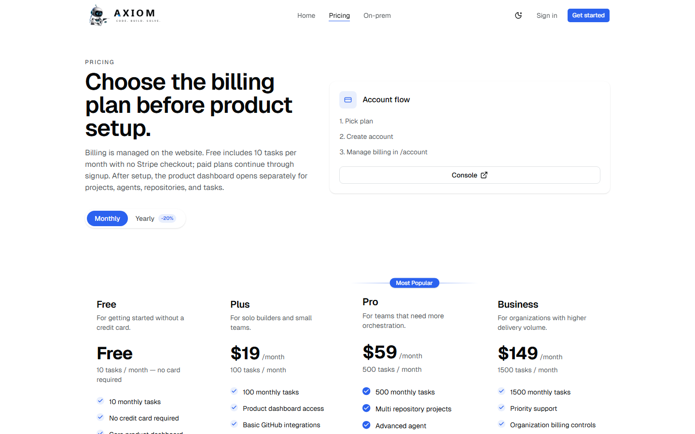
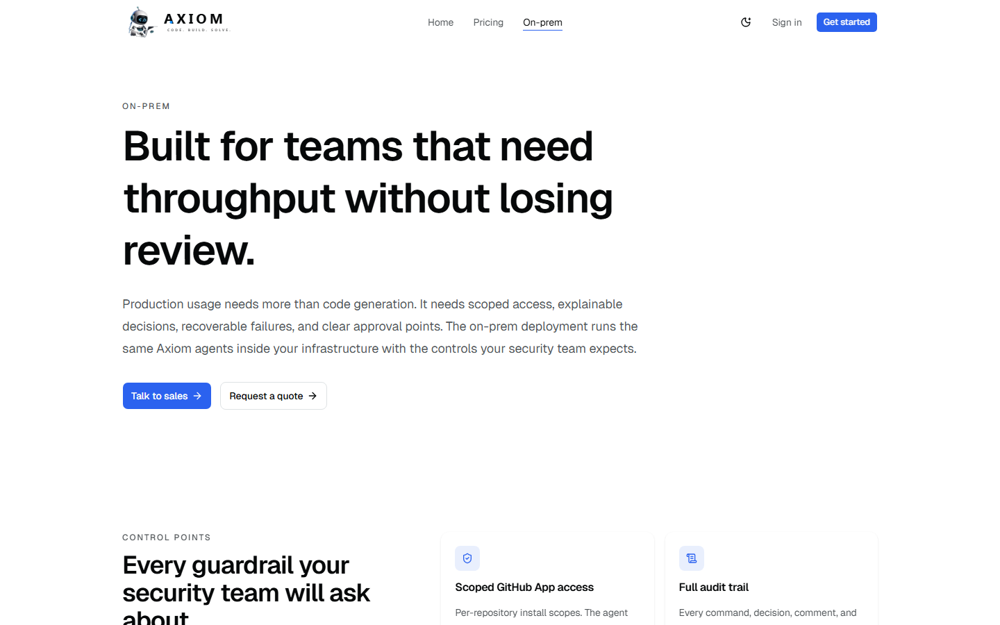

# Axiom: autonomous software engineers for your backlog

Axiom turns backlog tasks into reviewed pull requests, with an agent that can implement, ask a clarifying question, or refuse, and records why.

**Live product:** https://axiom.sagentiq.com

> Source code is private; available for review on request during interviews.

## Problem

Coding agents are good at producing diffs and bad at fitting into how a team already works. Three gaps kept coming up:

- **Work lives in a tracker, not in a chat box.** Engineers do not want a second place to paste requirements. The task in the project tool should be the unit of work.
- **Agents guess.** When a ticket is vague, most agents write plausible code anyway. A useful agent needs a first-class way to say "I need one more answer" or "this should not be done".
- **Nobody can audit a transcript.** Reviewers want to know what the agent decided, with which configuration, and why, without reading a long conversation.

Axiom is my attempt at an agent with explicit boundaries: every task ends in a defined outcome (pull request, question, or rejection), and every step leaves a structured record.

## What it does

1. A task is created in Axiom, or arrives from Linear (assignment, mention, or agent session), and is assigned to an agent.
2. The platform checks the organization's plan quota, then enqueues the task. The worker picks it up and marks it `IN_PROGRESS`.
3. The agent builds context: repository structure, project documents, prior comments, and semantic search hits over indexed code and docs.
4. A preflight decision follows. Possible outcomes: proceed, split into subtasks with dependencies, ask for clarification, or reject.
5. If it proceeds, the agent works in an isolated git worktree on a new branch, runs its tools, then commits, pushes, and opens a GitHub pull request. The task moves to `IN_REVIEW`.
6. If it asks, the question is posted as a task comment and the task moves to `NEEDS_CLARIFICATION`. If it refuses, the reason is posted and the task moves to `REJECTED`. Moving either task back to `TODO` re-queues it.
7. Comments and status changes are mirrored back to Linear, and live progress streams to the dashboard over Server-Sent Events.

## Architecture

The system is a pnpm and Turborepo monorepo with five apps and thirteen shared packages.

- **Backend** owns the canonical task model, authorization, billing, integrations, and the public and admin APIs. It is the only component that talks to external task trackers.
- **Agent worker** is a headless queue consumer with no public API. It reads the task from Postgres, runs the lifecycle, and reports back through events. Job payloads carry only identifiers, so the worker always reads fresh state instead of trusting a stale payload.
- **Postgres** is the single source of truth, including vector embeddings for retrieval (pgvector).
- **Redis and BullMQ** decouple intake from execution. Indexing runs on its own queue so long reindexes cannot starve task execution.
- **Integrations are adapters over the canonical model.** Inbound provider webhooks are normalized onto an inbound queue, and outbound changes flow through an outbound queue. Writes that originate from an integration are marked, which suppresses echo loops.

## Agent lifecycle

Task states below are the real status enum used by the platform. Arrows show transitions performed by the worker or by a user.

Notes on the diagram:

- Preflight resolves to one of four outcomes: proceed, split, needs clarification, or reject. A split creates child tasks with blocking dependencies and parks the parent in `BLOCKED`.
- Every phase writes a step to a task audit log. Failures also create an error event and an in-app notification for the reporter.
- A separate run record tracks each execution with its own status, workspace, and configuration snapshot.
- Per-task git worktrees are removed in a `finally` block after every run, whether it succeeded, failed, or was rejected, so stale references cannot block later runs.

## Key engineering decisions

**1. Decision audit log instead of a chat transcript.**
Each phase of a run (planning, preflight, quality gate, execution, result processing) writes a structured step to a task audit table, mirrored to the backend as typed events with a coarse category for timeline color coding. A reviewer can answer "what did the agent decide?" by reading steps, not prose. Transcripts are long, unstructured, and hard to compare across runs.

**2. Explicit outcomes with a gate before execution.**
"Ask" and "reject" are first-class task states, not failure modes. Before any code is touched, a gate evaluates tool permissions, repository state, and dependency conflicts, and the preflight uses semantic retrieval evidence (a minimum number of hits above a similarity threshold) to judge whether the task is well specified. I removed an earlier keyword-based heuristic that blocked short but clear tasks, because false blocks erode trust faster than an occasional clarifying question.

**3. Run configuration snapshots.**
Agents are editable, so "which model and tools did this run use?" cannot be answered by reading the agent later. Before a run starts, the worker records the resolved agent settings and the resolved model for each role (planning and coding) on the run. The prompt body is deliberately not copied, only whether a custom prompt was in force. Resolution failures are recorded on the run instead of thrown, so the reason stays attached to the evidence.

**4. Idempotent webhooks and deterministic job ids.**
Stripe delivers at least once, so each event id is claimed in a unique-indexed table before handlers run, and duplicates return early. GitHub deliveries are deduplicated by delivery id. Linear does not provide a per-delivery id, so deliveries are deduplicated by a hash of the signed raw body. Queue jobs derive deterministic ids from tenant, kind, and task, so double clicks and retries collapse into one job. The Stripe path documents its trade-off in code: a handler failure after the claim is not retried, which is acceptable only because every handler is itself an idempotent upsert.

**5. Tenancy and credential hygiene on the worker.**
The worker never trusts the job payload for tenancy. It reloads the task, cross-checks the tenant recorded on the task against the tenant in the job, and aborts on mismatch. Model provider credentials are stored per organization and encrypted at rest with AES-256-GCM. GitHub access uses per-repository installation tokens, so the agent only reaches repositories the customer connected.

**6. Quota that cannot lock customers out, and pricing owned by Stripe.**
Plan limits are counted from the task table for the current billing period, excluding soft-deleted tasks, rather than from an increment-only usage counter, which would have locked an organization out permanently after deleting tasks. Usage logs remain as an audit signal only. Checkout and customer portal URLs are built server-side from configuration, never accepted from the client. Plan rows are reconciled from Stripe products and prices at boot, with local defaults for the free tier, so pricing changes happen in Stripe rather than in a deploy.

## Tech stack

| Area | Technology |
| --- | --- |
| Monorepo | pnpm workspaces, Turborepo, TypeScript |
| Backend | NestJS 11, Prisma, Passport JWT, Socket.IO, Server-Sent Events, Swagger, Bull Board |
| Agent worker | NestJS, BullMQ, Octokit (GitHub App auth), Model Context Protocol SDK, tree-sitter (WASM), Vercel AI SDK, Zod |
| Data | PostgreSQL with pgvector, Redis |
| Frontends | Next.js 16 and React 19 (marketing site), React with Vite and React Router (dashboard and admin), Tailwind, SWR, Zustand |
| LLM layer | Provider-agnostic package: OpenAI, Anthropic, OpenRouter, and custom OpenAI-compatible endpoints; per-role model resolution |
| Billing | Stripe Checkout, customer portal, signed webhooks |
| Observability | Langfuse with OpenTelemetry tracing and prompt management |
| Delivery | Docker images built in GitHub Actions, pushed to GHCR, rolled out through Dokploy; Cloudflare tunnel for staging |
| Testing | Jest unit tests covering the orchestrator, audit emitter, LLM credential resolution, agent profile resolution, RAG chunking and search, and the sandbox runner |

## Billing and plans

Plans as published on the pricing page. Yearly billing is offered at a 20 percent discount.

| | Free | Plus | Pro | Business |
| --- | --- | --- | --- | --- |
| Price | $0 | $19 / month | $59 / month | $149 / month |
| Tasks per month | 10 | 100 | 500 | 1500 |
| Task concurrency | 1 | 1 | 3 | 10 |
| Repositories | 1 | 1 | Unlimited | Unlimited |
| Priority support | No | No | No | Yes |

Free needs no card. An on-prem option is offered separately, with a bring-your-own model key and per-repository GitHub App scopes.

## Current scope

Task intake from Linear and pull request delivery on GitHub are implemented end to end. The landing page lists Jira and ClickUp alongside Linear; the integration layer is built as adapters so more trackers can be added, but Linear is the one implemented today. GitLab and Bitbucket exist only as repository provider stubs.

## My role

Founder and sole engineer: product, architecture, implementation, deployment.

Axiom is built under Sagentiq, my AI product studio.

## More screenshots

## Contact

Cihan Taylan
LinkedIn: [linkedin.com/in/cihantaylan](https://www.linkedin.com/in/cihantaylan)

---

All rights reserved. This repository contains documentation only.
